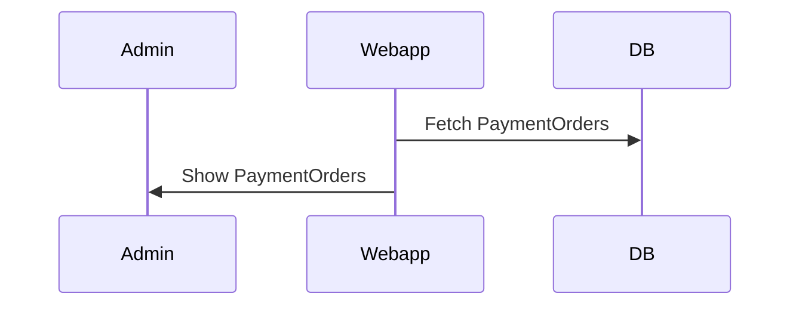
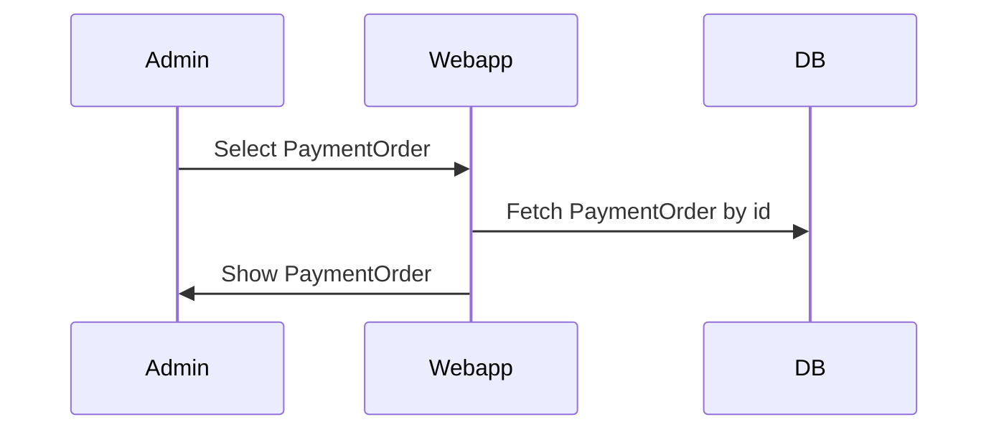
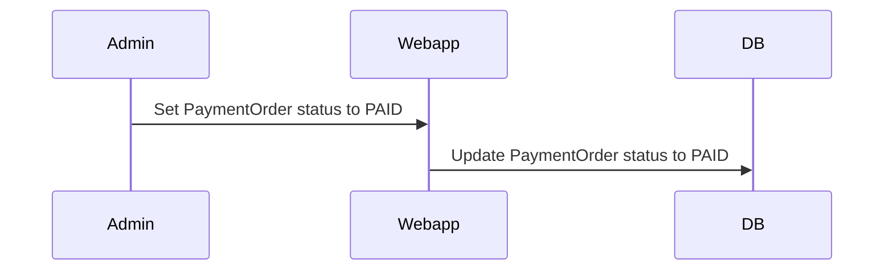

# Web App - Admin

## View PaymentOrder List
Admin can see a list of PaymentOrder

### Application Flow

## View PaymentOrder Detail
Admin can view PaymentOrder detail

### Application Flow

## Update PaymentOrder status
Admin can update PaymentOrder status.  
After an Admin has fulfilled the Fiat payment, he can update the PaymentOrder status to PAID

### Application Flow

