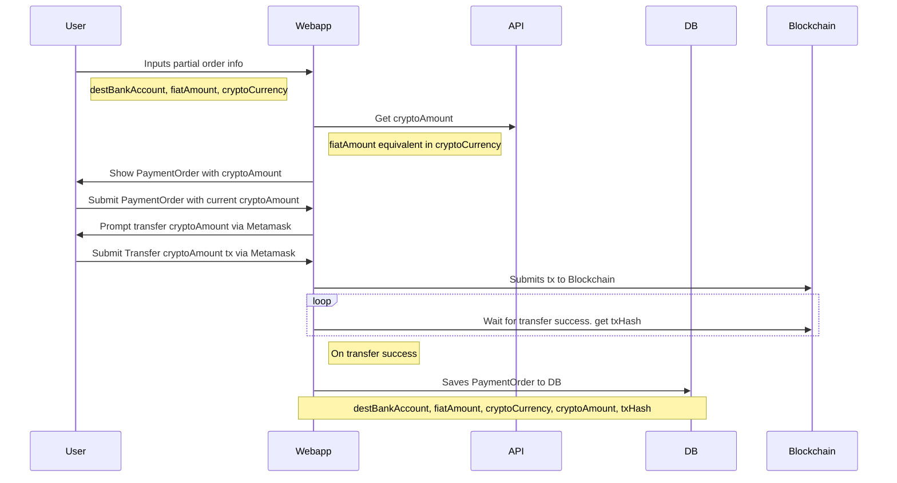

# Web App - User

## Create PaymentOrder
A user can create a [PaymentOrder](./data-types#paymentorder)

### Application Flow

```mermaid
sequenceDiagram
  participant U as User
  participant W as Webapp
  participant API
  participant DB
  participant BC as Blockchain

  U->>W: Inputs partial order info
  Note right of U: destBankAccount, fiatAmount, cryptoCurrency
  W->>API: Get cryptoAmount
  Note right of W: fiatAmount equivalent in cryptoCurrency 
  W->>U: Show PaymentOrder with cryptoAmount
  U->>W: Submit PaymentOrder with current cryptoAmount
  W->>U: Prompt transfer cryptoAmount via Metamask
  U->>W: Submit Transfer cryptoAmount tx via Metamask
  W->>BC: Submits tx to Blockchain
  loop
    W->>BC: Wait for transfer success. get txHash
  end
  Note right of W: On transfer success
  W->>DB: Saves PaymentOrder to DB
  Note over W,DB: destBankAccount, fiatAmount, cryptoCurrency, cryptoAmount, txHash
```
